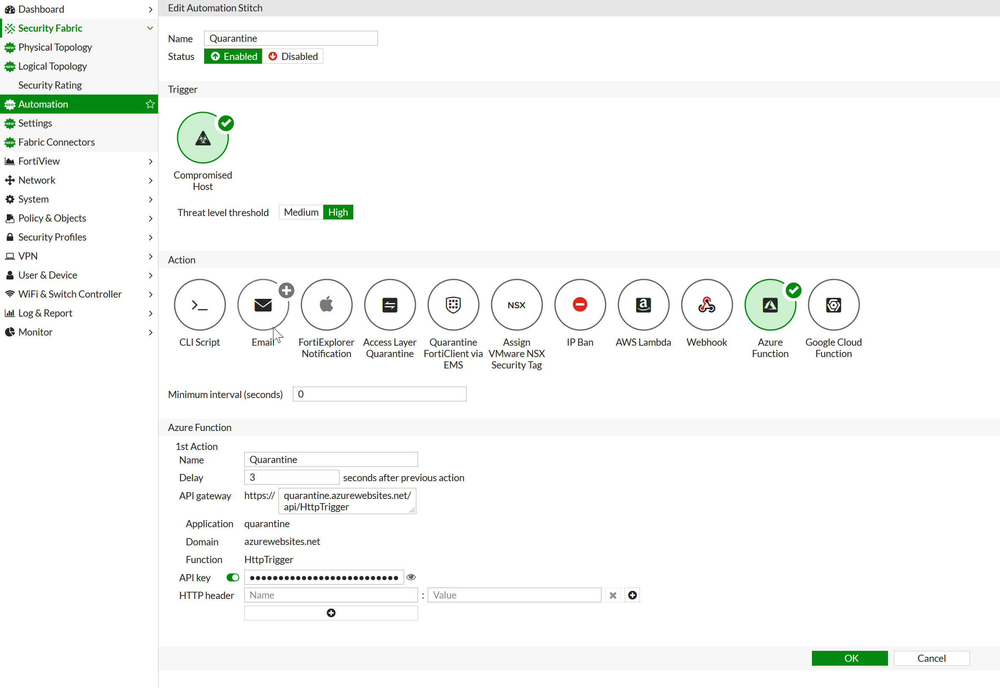

# Introduction
This Azure function works with a FortiGate Automation Action to change the security group of a requested VM to one specified in an environment variable.
This function uses Node.js and requires that the resource group be set as an environment variable.
It works by first fetching information on all the VMs in a resource group, querying their respective network cards and then their attached public IP addresses.

> **Note:** If you have more than one network card attached to a VM this function will not change the security group for all of them, only the network card with the associated IP address.

# Set up the Azure function

This function uses a service principal to authenticate. For details on setting up a service principal, refer to the Microsoft article [Create an Azure service principal with Node.js](https://docs.microsoft.com/en-us/javascript/azure/node-sdk-azure-authenticate-principal?view=azure-node-latest). Additional code samples can be found in the [Azure Github repository](https://github.com/Azure/azure-sdk-for-node/blob/master/Documentation/Authentication.md).

  1. In the Azure portal, click **Create a resource** from the upper left-hand corner.
  2. Click **Compute** and then **Function App**.
  3. For **OS**, click on **Windows**.
  4. Under **Runtime Stack**, select **JavaScript**.
  5. Click **Create**.
  6. Expand the new function app.
  7. Click the **+** button next to **Functions**.
  8. If this is the first time you have created a function, click **In-portal** and then **Webhook + API**. To set the **Authorization Level**, expand the newly created function and click **Integrate**. If this is not the first function to be created, click **HTTP trigger**.
  9. Under **Authorization Level**, select **Function**.
  10. Install dependencies by uploading the provided `package.json` and running `npm install` in the **Console** window of the function. Alternatively, install the following dependencies individually:
      * `ms-rest-azure`
      * `azure-arm-network`
      * `azure-arm-compute`
  11. Replace the template code with the provided `index.js`. Alternatively, deploy using Visual Studio.
  12. Select the function app and click **Application settings**.
  13. Under **Application settings** add the following:
      * **SUBSCRIPTION_ID:** Your Subscription ID.
      * **RESOURCE_GROUP:** The Resource Group in which the VMs are located.
      * **TENANT_ID:** Domain Or Tenant ID.
      * **REST_APP_ID:** Client or App ID.
      * **REST_APP_SECRET:** Password or Secret.
      * **QUARANTINE_SECURITY_GROUP:** The Network Security Group you want to use to quarantine VMs.

# Set up the FortiGate

  1. Log into your FortiGate.
  2. Select **Security Fabric > Automation**.
  3. Click **Create New**.
  4. Enter a **Name** for the Automation Stitch.
  5. Under **Trigger**, select **Compromised Host**.
  6. Under **Action**, select **Azure Function**.
  7. Set the **Azure Function** parameters, with the **API gateway** and the settings generated in the previous section.

An example is shown below.

  

# Support
Fortinet-provided scripts in this and other GitHub projects do not fall under the regular Fortinet technical support scope and are not supported by FortiCare Support Services.
For direct issues, please refer to the [Issues](https://github.com/fortinet/azure-security-group-update/issues) tab of this GitHub project.
For other questions related to this project, contact [github@fortinet.com](mailto:github@fortinet.com).

## License
[License](./LICENSE) © Fortinet Technologies. All rights reserved.
